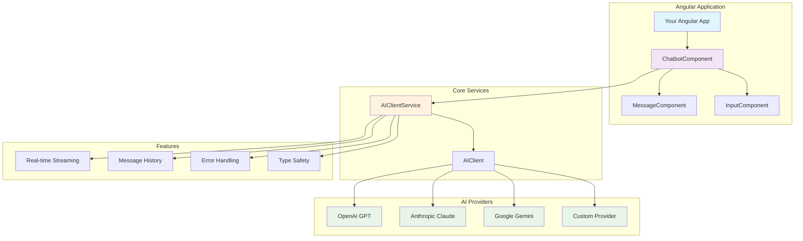
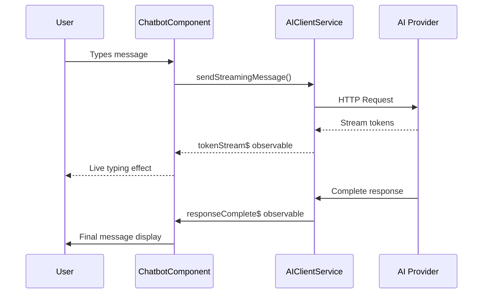

# Angular Chatbot AI 🤖

[](https://www.npmjs.com/package/@neurodevworks/chatbot-core)
[](https://www.npmjs.com/package/@neurodevworks/angular-chatbot)
[](https://opensource.org/licenses/MIT)
[](https://github.com/NeuroDevWorks/angular-chatbot-ai)
[](https://www.npmjs.com/package/@neurodevworks/chatbot-core)

**Next-Generation Conversational AI Components for Angular Applications**

Advanced AI chatbot components with multi-provider support, real-time streaming, and beautiful Material Design UI. Build intelligent conversational experiences with leading AI providers like OpenAI, Claude, and Gemini.

## 🏗️ Architecture Overview



## 🚀 Features

- **🤖 Multi-AI Provider Support**: OpenAI, Claude, Gemini, and custom providers
- **⚡ Real-time Streaming**: Live typing indicators and streaming responses
- **🎨 Beautiful UI**: Material Design components with customizable themes
- **📝 TypeScript First**: Full type safety and IntelliSense support
- **🚀 Production Ready**: Optimized for performance and scalability
- **🔧 Easy Integration**: Simple setup with comprehensive documentation
- **📱 Responsive Design**: Mobile-first approach with adaptive layouts
- **🔒 Secure**: Built-in API key management and secure communication
- **🎯 Customizable**: Extensive theming and configuration options
- **📊 Analytics Ready**: Built-in hooks for tracking and analytics

## 🌐 Supported AI Providers

| Provider | Models | Streaming | Status | Features |
|----------|--------|-----------|--------|----------|
| **OpenAI** | GPT-3.5-turbo, GPT-4, GPT-4-turbo | ✅ | 🟢 Production | Function calling, Vision |
| **Anthropic Claude** | Claude-3-haiku, Claude-3-sonnet, Claude-3-opus | ✅ | 🟢 Production | Large context, Safety |
| **Google Gemini** | Gemini-pro, Gemini-pro-vision | ✅ | 🟡 Beta | Multimodal, Code generation |
| **Custom Provider** | Any REST API | ✅ | 🟢 Production | Flexible integration |

### 🔑 API Configuration Examples

```typescript
// OpenAI Configuration
const openaiConfig = {
  provider: 'openai',
  apiKey: 'sk-...',
  model: 'gpt-4',
  baseUrl: 'https://api.openai.com/v1' // Optional
};

// Claude Configuration
const claudeConfig = {
  provider: 'claude',
  apiKey: 'sk-ant-...',
  model: 'claude-3-sonnet-20240229',
  baseUrl: 'https://api.anthropic.com' // Optional
};

// Gemini Configuration
const geminiConfig = {
  provider: 'gemini',
  apiKey: 'AI...',
  model: 'gemini-pro',
  baseUrl: 'https://generativelanguage.googleapis.com' // Optional
};
```

## 📦 Packages

This monorepo contains the following packages:

### [@neurodevworks/chatbot-core](https://www.npmjs.com/package/@neurodevworks/chatbot-core)
Core AI client services and utilities for chatbot functionality.
- **Size**: ~33KB (gzipped)
- **Dependencies**: Minimal (eventsource-parser)
- **Features**: Multi-provider support, streaming, TypeScript

### [@neurodevworks/angular-chatbot](https://www.npmjs.com/package/@neurodevworks/angular-chatbot)
Angular components and services for building chatbot interfaces.
- **Size**: ~45KB (gzipped)
- **Dependencies**: Angular Material, Core package
- **Features**: UI components, themes, responsive design

## 🎮 Live Demo

Experience the chatbot in action with real AI responses!

```bash
# Clone and run the demo
git clone https://github.com/NeuroDevWorks/angular-chatbot-ai.git
cd angular-chatbot-ai
npm install
npm run demo
```

Visit `http://localhost:8080` to see the interactive demo.

## 🔄 Component Interaction Flow



## 🛠️ Quick Start

### 1. Installation

```bash
# Install both packages
npm install @neurodevworks/chatbot-core @neurodevworks/angular-chatbot

# Or install individually
npm install @neurodevworks/chatbot-core
npm install @neurodevworks/angular-chatbot
```

### 2. Basic Setup

```typescript
import { Component } from '@angular/core';
import { ChatbotComponent } from '@neurodevworks/angular-chatbot';
import { AIClientService } from '@neurodevworks/chatbot-core';

@Component({
  selector: 'app-chat',
  template: `
    <ai-chatbot
      [config]="chatConfig"
      [options]="chatOptions"
      (messageReceived)="onMessageReceived($event)"
      (messageSent)="onMessageSent($event)">
    </ai-chatbot>
  `,
  imports: [ChatbotComponent]
})
export class ChatComponent {
  chatConfig = {
    apiKey: 'your-openai-api-key',
    provider: 'openai',
    model: 'gpt-3.5-turbo'
  };

  chatOptions = {
    title: 'AI Assistant',
    placeholder: 'Ask me anything...',
    streaming: true,
    showAvatars: true,
    theme: 'light'
  };

  onMessageReceived(message: any) {
    console.log('AI responded:', message);
  }

  onMessageSent(message: any) {
    console.log('User sent:', message);
  }
}
```

### 3. Advanced Configuration

```typescript
// Advanced AI configuration
const advancedConfig = {
  provider: 'openai',
  apiKey: 'sk-...',
  model: 'gpt-4',
  temperature: 0.7,
  maxTokens: 1000,
  streaming: true
};

// Advanced UI options
const advancedOptions = {
  title: 'Smart Assistant',
  placeholder: 'How can I help you today?',
  theme: 'dark',
  showAvatars: true,
  enableFileUpload: true,
  enableVoiceInput: true,
  markdown: true,
  autoScroll: true
};
```

## 🎯 Key Features

### 🤖 Multi-Provider Support
| Feature | OpenAI | Claude | Gemini | Custom |
|---------|--------|--------|--------|--------|
| **Text Generation** | ✅ | ✅ | ✅ | ✅ |
| **Streaming** | ✅ | ✅ | ✅ | ✅ |
| **Function Calling** | ✅ | ✅ | ⏳ | ✅ |
| **Vision/Images** | ✅ | ✅ | ✅ | ✅ |
| **Large Context** | ✅ | ✅ | ✅ | ✅ |

### 🎨 Advanced UI Components
- **🔄 Streaming Responses**: Real-time message updates with typing indicators
- **💾 Message History**: Persistent conversation management with local storage
- **⌨️ Typing Indicators**: Visual feedback during AI processing
- **📎 File Upload**: Support for document and image uploads (PDF, TXT, Images)
- **🎤 Voice Input**: Speech-to-text integration with Web Speech API
- **🎨 Theme Support**: Light, dark, auto, and custom themes with CSS variables
- **📱 Responsive Design**: Mobile-first approach with adaptive layouts
- **♿ Accessibility**: WCAG 2.1 AA compliant with screen reader support

### 👨‍💻 Developer Experience
- **📝 TypeScript**: Full type safety and autocompletion with 100% type coverage
- **🅰️ Angular 18+**: Latest Angular features and standalone components
- **🔄 Reactive**: RxJS-based reactive programming with observables
- **🧪 Testing**: Comprehensive test coverage with Jest and Cypress
- **📚 Documentation**: Detailed API documentation with interactive examples
- **🔧 DevTools**: Built-in debugging and development tools

## 📊 Performance Metrics

| Metric | Value | Description |
|--------|-------|-------------|
| **Bundle Size** | ~78KB | Total gzipped size for both packages |
| **First Paint** | <100ms | Time to first visual element |
| **Time to Interactive** | <200ms | Time until fully interactive |
| **Memory Usage** | <5MB | Average memory footprint |
| **API Response** | <500ms | Average response time (OpenAI) |
| **Streaming Latency** | <50ms | Token-to-display latency |

### 🚀 Optimization Features
- **Tree Shaking**: Only import what you use
- **Lazy Loading**: Components loaded on demand
- **Virtual Scrolling**: Efficient handling of long conversations
- **Caching**: Intelligent response caching
- **Compression**: Gzip compression for all assets

## 🏗️ Development

### Prerequisites
- **Node.js**: 18.0.0 or higher
- **npm**: 9.0.0 or higher
- **Angular CLI**: 18.0.0 or higher
- **TypeScript**: 5.5.0 or higher

### Setup
```bash
# Clone the repository
git clone https://github.com/NeuroDevWorks/angular-chatbot-ai.git
cd angular-chatbot-ai

# Install dependencies
npm install

# Build packages
npm run build:packages

# Start demo
npm run demo

# Run tests
npm run test

# Lint code
npm run lint
```

### Project Structure
```
angular-chatbot-ai/
├── packages/
│   ├── core/                 # @neurodevworks/chatbot-core
│   │   ├── src/lib/         # Core services and types
│   │   ├── dist/            # Built package
│   │   └── package.json     # Package configuration
│   └── chatbot/             # @neurodevworks/angular-chatbot
│       ├── src/lib/         # Angular components
│       ├── dist/            # Built package
│       └── package.json     # Package configuration
├── demo/                    # Interactive demo application
│   ├── src/app/            # Demo source code
│   └── package.json        # Demo dependencies
├── docs/                    # Documentation files
└── scripts/                 # Build and deployment scripts
```

## 🚨 Troubleshooting

### Common Issues

#### "AI is thinking..." Never Resolves
```typescript
// Check API key format
if (!apiKey.startsWith('sk-')) {
  console.error('Invalid OpenAI API key format');
}

// Verify network connectivity
try {
  const response = await fetch('https://api.openai.com/v1/models', {
    headers: { 'Authorization': `Bearer ${apiKey}` }
  });
  console.log('API accessible:', response.ok);
} catch (error) {
  console.error('Network error:', error);
}
```

#### CORS Issues
```typescript
// For development, use a proxy
// In angular.json:
"serve": {
  "builder": "@angular-devkit/build-angular:dev-server",
  "options": {
    "proxyConfig": "proxy.conf.json"
  }
}

// proxy.conf.json:
{
  "/api/*": {
    "target": "https://api.openai.com",
    "secure": true,
    "changeOrigin": true,
    "logLevel": "debug"
  }
}
```

#### Memory Leaks
```typescript
// Always unsubscribe from observables
ngOnDestroy() {
  this.subscriptions.forEach(sub => sub.unsubscribe());
}

// Use takeUntil pattern
private destroy$ = new Subject<void>();

ngOnInit() {
  this.aiService.tokenStream$
    .pipe(takeUntil(this.destroy$))
    .subscribe(token => {
      // Handle token
    });
}

ngOnDestroy() {
  this.destroy$.next();
  this.destroy$.complete();
}
```

### Debug Mode
```typescript
// Enable debug logging
const aiClient = new AIClientService();
aiClient.setDebugMode(true);

// Check service status
console.log('Initialized:', aiClient.isInitialized);
console.log('Loading:', aiClient.isLoading);
console.log('Error:', aiClient.error);
```

## 🤝 Contributing

We welcome contributions! Please follow these steps:

1. Fork the repository
2. Create your feature branch (`git checkout -b feature/amazing-feature`)
3. Commit your changes (`git commit -m 'Add amazing feature'`)
4. Push to the branch (`git push origin feature/amazing-feature`)
5. Open a Pull Request

## 📄 License

This project is licensed under the MIT License.

## 👨‍💻 Author

**Manoj Kumar**
- Email: manojkumar.smgr@gmail.com
- GitHub: [@neurodevworks](https://github.com/neurodevworks)
- NPM: [@neurodevworks](https://www.npmjs.com/~neurodevworks)

## 🙏 Acknowledgments

- Angular team for the amazing framework
- OpenAI for the powerful AI models
- Material Design for the beautiful UI components
- The open-source community for inspiration and support

---

Made with ❤️ by [NeuroDevWorks](https://github.com/NeuroDevWorks)